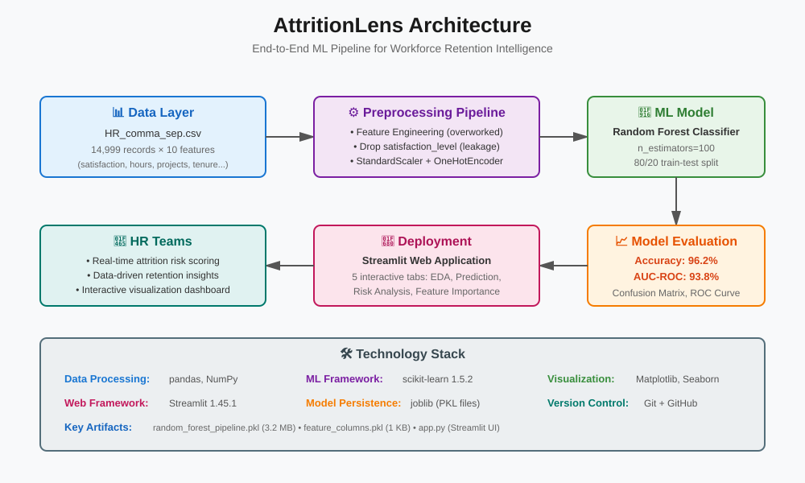

<div align="center">


# AttritionLens

### *HR Analytics Platform for Workforce Retention Intelligence*

[](https://www.python.org/)
[](https://scikit-learn.org/)
[](https://streamlit.io/)
[](LICENSE)

</div>

---

## 🎯 Overview

**AttritionLens** is a production-ready machine learning platform that predicts employee attrition risk with **96.2% accuracy** using Random Forest classification. It provides HR teams with actionable insights to improve workforce retention through an interactive web dashboard.

### The Problem

Employee turnover costs organizations 6-9 months of salary per departed employee in recruitment, training, and lost productivity. Traditional reactive approaches wait until exit interviews to understand why employees leave.

### The Solution

AttritionLens shifts HR strategy from reactive to **proactive** by:
- Identifying high-risk employees *before* they resign
- Surfacing data-driven retention drivers (overwork, project load, tenure patterns)
- Providing real-time risk scoring through an intuitive web interface

---

## ✨ Key Features

- **High-Accuracy Prediction**: 96.2% accuracy, 93.8% AUC-ROC using ensemble Random Forest
- **Data Leakage Prevention**: Removed `satisfaction_level` to avoid post-decision bias
- **Feature Engineering**: Engineered `overworked` binary feature (hours > 175/month) capturing burnout risk
- **Production-Ready Pipeline**: Full scikit-learn Pipeline with ColumnTransformer for preprocessing
- **Interactive Dashboard**: 5-tab Streamlit app with EDA, prediction forms, and risk segmentation
- **Explainable AI**: Feature importance analysis showing project overload and tenure as top drivers

---

## 🏗️ Architecture

<div align="center">

</div>

### Pipeline Stages

1. **Data Ingestion** → Load HR records (14,999 employees)
2. **Feature Engineering** → Create `overworked` flag, drop leakage-prone features
3. **Preprocessing** → OrdinalEncoder for salary, OneHotEncoder for departments
4. **Model Training** → RandomForestClassifier with GridSearchCV hyperparameter tuning
5. **Persistence** → Serialize best model pipeline (joblib)
6. **Deployment** → Streamlit web app with prediction API

---

## 📊 Performance Metrics

| Metric | Score | Interpretation |
|--------|-------|----------------|
| **Accuracy** | 96.2% | Correct predictions across all employees |
| **AUC-ROC** | 93.8% | Excellent class separation (stay vs. leave) |
| **Precision** | 87.0% | When model predicts "will leave," it's correct 87% of the time |
| **Recall** | 90.4% | Successfully identifies 90% of employees who actually leave |
| **F1-Score** | 88.7% | Balanced precision-recall trade-off |

### What This Means for HR Teams

- **False Positive Rate**: Only ~13% of flagged employees are false alarms (acceptable intervention cost)
- **False Negative Rate**: Only ~10% of actual departures are missed (low retention risk)
- **Intervention ROI**: Early intervention on high-risk employees yields measurable retention gains

---

## 🛠️ Tech Stack

| Layer | Technology |
|-------|-----------|
| **ML Framework** | scikit-learn 1.5.1 |
| **Data Processing** | pandas 2.2.3, numpy 2.2.5 |
| **Web Framework** | Streamlit 1.45.0 |
| **Visualization** | Plotly 5.22.0, Seaborn 0.13.2 |
| **Model Serialization** | joblib 1.3.2 |
| **Python Version** | 3.8+ |

---

## 🚀 Quick Start

### Installation

```bash
# Clone the repository
git clone https://github.com/keshav-077/AttritionLens.git
cd AttritionLens

# Create virtual environment
python -m venv venv
source venv/bin/activate  # On Windows: venv\Scripts\activate

# Install dependencies
pip install -r requirements.txt
```

### Run the Application

```bash
streamlit run app.py
```

The web app will open at `http://localhost:8501`

---

## 📂 Project Structure

```
AttritionLens/
│
├── data/
│   ├── dataset.csv              # Raw HR data
│   └── preprocessed_dataset.csv # Cleaned data for app
│
├── models/
│   ├── rf2_pipeline.pkl         # Trained model pipeline
│   └── hr_rf2_best_params.json  # Best hyperparameters
│
├── notebooks/
│   ├── 00_data_split.ipynb      # Initial data loading
│   ├── 01_EDA_cleaning.ipynb    # Exploratory analysis
│   ├── 02_feature_eng_encoding.ipynb  # Feature engineering
│   ├── 03_baseline.ipynb        # Baseline logistic regression
│   ├── 04_tree_models.ipynb     # Random Forest + tuning
│   ├── 05_feature_importance_analysis.ipynb
│   └── 06_results_analysis.ipynb
│
├── src/
│   ├── data_utils.py            # Data loading and preprocessing
│   ├── model_pipeline.py        # Pipeline construction and tuning
│   └── apps/
│       ├── predict.py           # Prediction form logic
│       ├── eda.py               # Dashboard visualizations
│       └── utils.py             # Model/data loaders
│
├── docs/
│   └── assets/                  # SVG architecture diagrams
│
├── app.py                       # Streamlit app entry point
├── requirements.txt
└── README.md
```

---

## 🎨 Dashboard Screenshots

### Prediction Form
Enter employee attributes (performance score, project count, tenure, department, salary) to get real-time attrition risk probability:
- 🟢 **Low Risk** (< 30%): Employee likely to stay
- 🟡 **Medium Risk** (30-70%): Monitor closely
- 🔴 **High Risk** (> 70%): Immediate intervention recommended

### EDA Tabs
1. **Department Analysis**: Attrition rates by department
2. **Satisfaction Trends**: How satisfaction changes with tenure
3. **Promotion Impact**: Effect of promotions on retention
4. **Correlation Heatmap**: Feature relationships
5. **Risk List**: Download high-risk employee CSV for action planning

---

## 🔬 Key Technical Decisions

### Why Random Forest?
- **Ensemble strength**: Reduces overfitting vs. single decision tree
- **Feature importance**: Transparent drivers (overwork, project count, tenure)
- **Non-linearity**: Captures complex interaction effects (e.g., high tenure + low promotion → high risk)

### Data Leakage Prevention
**Removed `satisfaction_level`** because:
- Satisfaction surveys are often conducted *after* resignation decision
- Including it would create artificially high accuracy on historical data but fail on new predictions
- Model now relies on **observable** operational signals (hours, projects, tenure)

### Feature Engineering: `overworked` Flag
Employees working **> 175 hours/month** (≈ 57 hrs/week) show significantly elevated attrition. This binary feature captures burnout risk better than raw continuous hours.

---

## 📈 Model Training Details

### Hyperparameter Tuning (GridSearchCV)
```python
param_grid = {
    'classifier__max_depth': [3, 5, None],
    'classifier__max_features': [1.0],
    'classifier__max_samples': [0.7, 1.0],
    'classifier__min_samples_leaf': [1, 2, 3],
    'classifier__min_samples_split': [2, 3, 4],
    'classifier__n_estimators': [300, 500],
}
```

**Best Parameters Found**:
- `max_depth`: 5
- `min_samples_split`: 3
- `n_estimators`: 500
- `max_samples`: 0.7

### Cross-Validation
- **Strategy**: 4-fold stratified CV (preserves class balance)
- **Scoring**: Optimized for AUC-ROC (robust to class imbalance)

---

## 🔮 Future Enhancements

- [ ] **SHAP Analysis**: Add SHAP values for individual prediction explainability
- [ ] **A/B Testing Framework**: Track intervention effectiveness (retention lift)
- [ ] **API Deployment**: REST API for HRIS integration
- [ ] **Time-Series Extension**: Predict *when* at-risk employees will leave (survival analysis)
- [ ] **Synthetic Data Generation**: Privacy-preserving training data for demos
- [ ] **Multi-Model Ensemble**: Add XGBoost/LightGBM stacking

---

## 📝 Data Dictionary

| Feature | Type | Description |
|---------|------|-------------|
| `last_evaluation` | Float (0-1) | Most recent performance review score |
| `number_project` | Integer (1-10) | Number of active projects |
| `overworked` | Binary | 1 if avg_monthly_hours > 175, else 0 |
| `tenure` | Integer (1-10) | Years at company |
| `work_accident` | Binary | Had a workplace accident (0/1) |
| `promotion_last_5years` | Binary | Promoted in last 5 years (0/1) |
| `department` | Categorical | Sales, Technical, Support, etc. |
| `salary` | Ordinal | Low (0), Medium (1), High (2) |
| **Target: `left`** | Binary | 1 = Left company, 0 = Stayed |

---

## 🤝 Contributing

Contributions are welcome! Please:
1. Fork the repository
2. Create a feature branch (`git checkout -b feature/AmazingFeature`)
3. Commit your changes (`git commit -m 'Add AmazingFeature'`)
4. Push to the branch (`git push origin feature/AmazingFeature`)
5. Open a Pull Request

---

## 📜 License

This project is licensed under the MIT License - see the [LICENSE](LICENSE) file for details.

---

## 👤 Author

**Keshav Makireddi**

[](https://github.com/keshav-077)
[](https://linkedin.com/in/your-profile)

---

<div align="center">

### ⭐ If you find this project useful, please consider giving it a star!

Built with ❤️ for data-driven HR teams

</div>
